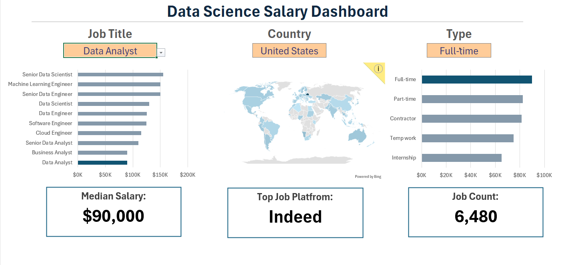

# 📊 Data Science Salary Dashboard (Microsoft Excel)

An interactive Excel dashboard that analyzes global **Data Science and Analytics job salaries** across different job titles, countries, employment types, and hiring platforms. Built entirely in Microsoft Excel using Pivot Tables, Pivot Charts, Slicers, KPI Cards, and Map Charts to transform job market data into actionable insights.

---

## 📌 Project Overview

The **Data Science Salary Dashboard** provides an interactive way to explore salary trends in the data industry. Users can filter the dashboard by **Job Title**, **Country**, and **Employment Type** to gain insights into compensation, hiring trends, and job market demand.

---

## 🎯 Objectives

- Analyze median salaries across different data-related job roles.
- Compare salaries by country.
- Explore salary distribution by employment type.
- Identify the leading hiring platform.
- Build an interactive dashboard with dynamic filters and KPIs.

---

## 🛠️ Tools & Technologies

- Microsoft Excel
- Pivot Tables
- Pivot Charts
- Slicers
- Map Chart
- KPI Cards
- Data Cleaning
- Dashboard Design

---

# 📷 Dashboard Preview



---

## ✨ Dashboard Features

### 🎯 Interactive Filters

- Job Title
- Country
- Employment Type

All charts and KPI cards update dynamically based on the selected filters.

### 💰 Salary Analysis

Compare median salaries across major data careers, including:

- Data Analyst
- Data Scientist
- Data Engineer
- Machine Learning Engineer
- Cloud Engineer
- Software Engineer
- Business Analyst
- Senior-level roles

### 🌍 Global Salary Distribution

Interactive world map showing salary information across countries.

### 💼 Employment Type Analysis

Compare salary trends for:

- Full-time
- Part-time
- Contract
- Internship
- Temporary Work

### 📊 KPI Cards

The dashboard highlights:

- Median Salary
- Top Hiring Platform
- Total Job Count

---

## 📈 Key Insights

- Senior-level data roles command the highest salaries.
- Full-time positions generally offer the highest compensation.
- Salary trends vary across different countries.
- Indeed is the leading hiring platform in the selected data.
- Interactive filters make it easy to compare salaries across multiple dimensions.

---

## 📁 Project Structure

```text
Project 1/
│
├── Dashboard/
│   └── data-science-salary-dashboard.png
│
├── Salary_Dashboard.xlsx
│
└── README.md
```

---

## 🚀 How to Use

1. Download or clone this repository.
2. Open **Salary_Dashboard.xlsx** using Microsoft Excel.
3. Navigate to the Dashboard worksheet.
4. Use the slicers to filter by Job Title, Country, and Employment Type.
5. Explore the interactive charts and KPI cards.

---

## 💡 Skills Demonstrated

- Excel Dashboard Development
- Data Visualization
- Pivot Tables & Pivot Charts
- Interactive Slicers
- KPI Design
- Business Intelligence
- Data Analysis
- Analytical Storytelling

---

## 📚 Learning Outcomes

This project helped strengthen my skills in:

- Designing professional Excel dashboards
- Creating interactive business reports
- Developing KPI-driven visualizations
- Analyzing salary trends across multiple dimensions
- Presenting insights through effective dashboard design

---

## 👩‍💻 Author

**Mansi Sharma**

Aspiring **Data Analyst** skilled in **Excel, SQL, Power BI, and Python**, with a passion for transforming raw data into actionable business insights.

---

⭐ If you found this project helpful, consider giving it a **Star** on GitHub!