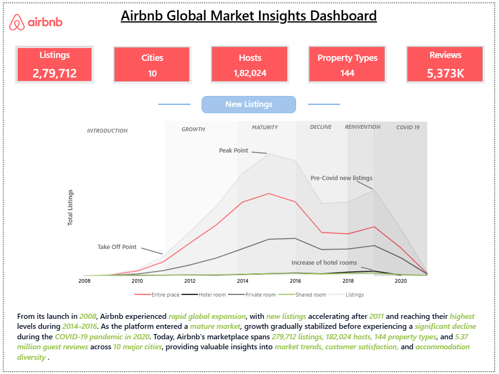
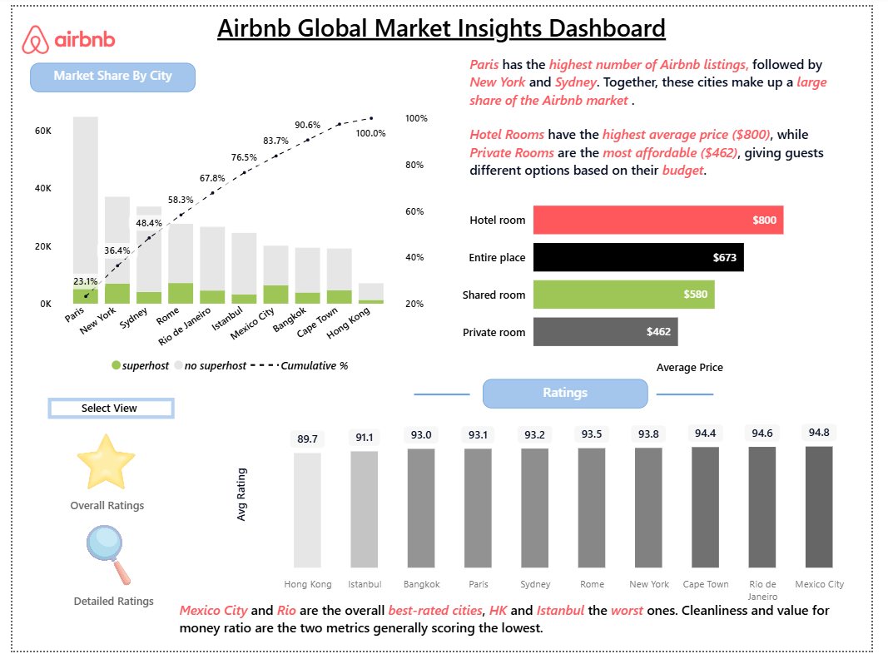
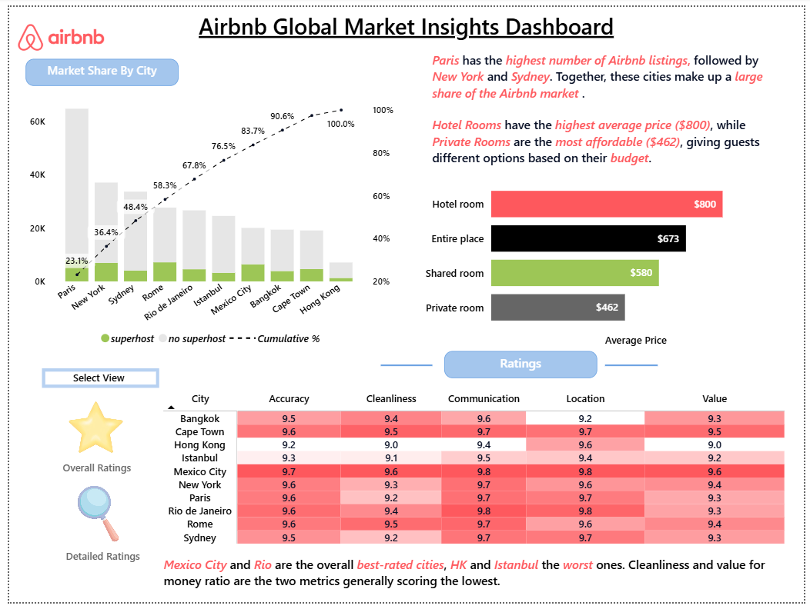

# 🏡 Airbnb Global Market Insights Dashboard

## 1. Project Title / Headline

**🏡 Airbnb Global Market Insights Dashboard**

An interactive Power BI dashboard that provides comprehensive insights into Airbnb listings, hosts, pricing, customer reviews, ratings, and market trends across major global cities. The dashboard enables users to analyze business performance, understand customer behavior, and compare cities based on accommodation availability, pricing, trust indicators, and guest satisfaction.

---

# 2. Short Description / Purpose

The **Airbnb Global Market Insights Dashboard** is an interactive Power BI report designed to explore Airbnb marketplace performance across **10 major cities**. It combines listing statistics, pricing, customer ratings, review behavior, seasonality, and host trust metrics into a single analytical platform, helping stakeholders make informed business and travel decisions.

---

# 3. Tech Stack

The dashboard was built using the following tools and technologies:

* 📊 **Power BI Desktop** – Primary platform for creating interactive reports and dashboards.
* 📂 **Power Query** – Used for cleaning, transforming, and preparing Airbnb datasets.
* 🧠 **DAX (Data Analysis Expressions)** – Developed calculated measures, KPIs, and dynamic metrics.
* 🔗 **Data Modeling** – Established relationships among listings, hosts, reviews, and ratings datasets for accurate analysis.
* 📈 **Interactive Visualizations** – KPI Cards, Pareto Charts, Heatmaps, Line Charts, Bar Charts, Matrix Tables, and Slicers.
* 📁 **File Format** – `.pbix/.pbit` for development and `.png` for dashboard previews.

---

# 4. Data Source

**Source:** Airbnb Open Data Dataset

The dataset contains Airbnb marketplace information from **10 major global cities**, including:

* Property listings
* Host information
* Property types
* Pricing
* Guest reviews
* Ratings
* Booking trends
* Trust indicators
* Seasonality
* Accommodation categories

The dashboard analyzes over:

* **279,712 Listings**
* **182,024 Hosts**
* **5.37 Million Reviews**
* **144 Property Types**

---

# 5. Features / Highlights

## • Business Problem

Airbnb operates in highly competitive global markets where understanding pricing strategies, customer satisfaction, host credibility, and market demand is essential.

Business stakeholders often need answers to questions such as:

* Which cities dominate the Airbnb market?
* Which accommodation types generate higher prices?
* How has Airbnb grown over time?
* Which cities receive the highest guest ratings?
* How trustworthy are Airbnb hosts?
* What seasonal trends influence customer reviews?
* How engaged are reviewers?

Analyzing thousands of listings manually makes these insights difficult to obtain.

---

## • Goal of the Dashboard

The dashboard aims to provide an interactive analytics solution that enables users to:

* Explore Airbnb market performance across cities.
* Analyze listing growth and marketplace expansion.
* Compare pricing across accommodation types.
* Evaluate customer ratings and reviews.
* Assess host trust and verification status.
* Identify seasonal demand patterns.
* Support strategic business and tourism decisions through data visualization.

---

## • Walkthrough of Key Visuals

### 📌 Dashboard Overview

Provides a high-level summary of Airbnb marketplace performance through KPI cards:

* Total Listings: **279,712**
* Cities Covered: **10**
* Hosts: **182,024**
* Property Types: **144**
* Guest Reviews: **5.37 Million**

A lifecycle line chart illustrates Airbnb's market evolution, highlighting rapid growth, maturity, and the impact of the COVID-19 pandemic on new listings.

---

### 📊 Market Share by City

A Pareto chart compares Airbnb listings across major cities while displaying cumulative market contribution.

Key insights include:

* Paris leads with the highest number of listings.
* New York and Sydney also contribute significantly.
* A small number of cities account for the majority of Airbnb listings.

---

### 💰 Average Price by Property Type

A horizontal bar chart compares accommodation prices:

* Hotel Rooms
* Entire Places
* Shared Rooms
* Private Rooms

This visualization helps users understand pricing differences across property categories and supports budget-based decision-making.

---

### ⭐ Ratings Analysis

Interactive rating views allow users to explore:

* Overall city ratings
* Detailed category ratings
* Accuracy
* Cleanliness
* Communication
* Location
* Value for Money

A heatmap highlights strengths and weaknesses across cities, enabling performance benchmarking.

---

### 📝 Review Frequency Analysis

A Pareto analysis of reviewer activity reveals that:

* Most reviewers contribute only one review.
* Very few reviewers submit multiple reviews.

This insight highlights strong initial customer participation but relatively low repeat review engagement.

---

### 📅 Seasonality Analysis

A monthly review trend visualization compares customer activity across cities.

The dashboard identifies:

* Peak tourism seasons
* Holiday-driven demand
* Seasonal review fluctuations
* Regional travel patterns

---

### 🛡 Trust Analysis

A trust dashboard evaluates host credibility through indicators such as:

* Identity Verification
* Profile Picture Availability
* Verification Status

These metrics provide insight into platform safety and host reliability.

---

## • Business Impact & Insights

### Market Intelligence

Businesses can identify high-performing Airbnb markets and evaluate competitive positioning across global cities.

### Pricing Optimization

Hosts and property managers can compare pricing strategies across accommodation types to maximize revenue.

### Customer Experience

Rating analysis highlights service strengths and improvement opportunities, helping hosts enhance guest satisfaction.

### Tourism Planning

Travelers can compare destinations based on pricing, ratings, seasonality, and accommodation availability.

### Platform Trust

Host verification and trust metrics strengthen confidence in Airbnb's marketplace and improve transparency for guests.

### Strategic Decision Making

Interactive filters and visual analytics enable tourism organizations, investors, and business analysts to uncover trends quickly and make data-driven decisions.

---

# 6. Screenshots / Demo

## Dashboard Preview

### 🏠 Overview Dashboard

```markdown

```

---

### 📈 Market Share & Ratings Dashboard

```markdown

```

---

### ⭐ Detailed Ratings Dashboard

```markdown

```

---

### 📝 Reviews & Trust Dashboard

```markdown

```

---

# 📌 Key Insights

* 🌍 Analyze **279,712 Airbnb listings** across **10 major global cities**.
* 🏠 Compare **144 property types** and **182,024 hosts**.
* ⭐ Evaluate guest satisfaction using detailed ratings across multiple service dimensions.
* 💰 Compare accommodation pricing to identify premium and budget-friendly options.
* 📅 Discover seasonal demand and customer review patterns.
* 🛡 Assess host trust through identity verification and profile completeness.
* 📊 Explore Airbnb's market growth, city performance, and customer engagement through interactive Power BI visualizations.
